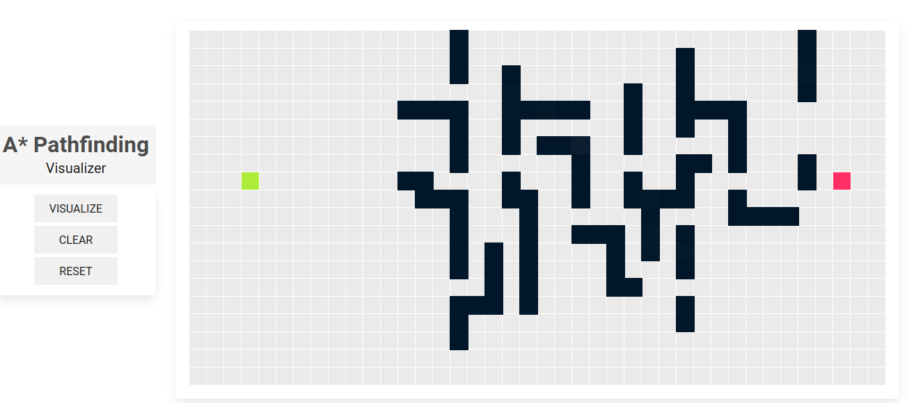
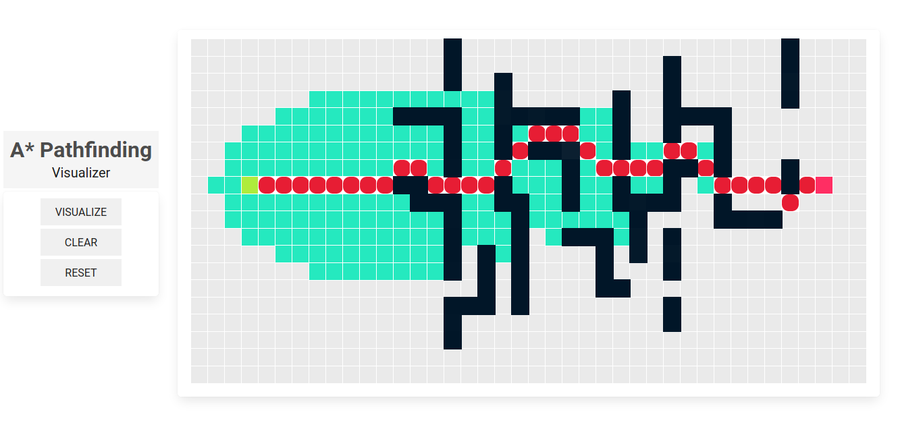

# A\* Pathfinding




## Table of Contents

- [A\* Pathfinding](#a-pathfinding)
	- [Table of Contents](#table-of-contents)
	- [Project Structure](#project-structure)
		- [`Grid.tsx`](#gridtsx)
		- [`Node.tsx`](#nodetsx)
		- [`A*.tsx`](#atsx)
		- [`NodeInterface.tsx`](#nodeinterfacetsx)

A React app to visualize the A\* path-finding algorithm

## Project Structure

There are 3 main (.tsx) files in the project

- Grid
- Node
- A\*

### `Grid.tsx`

Holds the logic behind displaying and animating the algorithm and all of the event handlers used by the Node component. <br>
also style file :
`Grid.css`

### `Node.tsx`

Simple dumb component responsible only for displaying a single node and calling the proper event handler . <br>
style file contains the animation keyframes :
`node.css`

### `A*.tsx`

Contains the algorithm logic , mainly a function aStar()

```js
const aStar: (
	grid: INode[][],
	 start: INode,
	 end: INode
	 ) => INode[] | undefined
```

### `NodeInterface.tsx`

contains an interface to represent a single node and a function to compare nodes.
